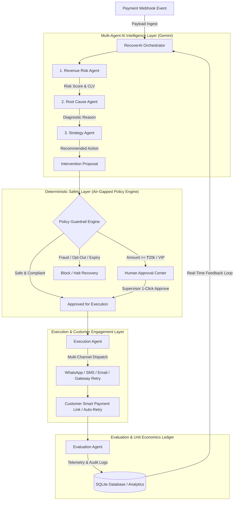
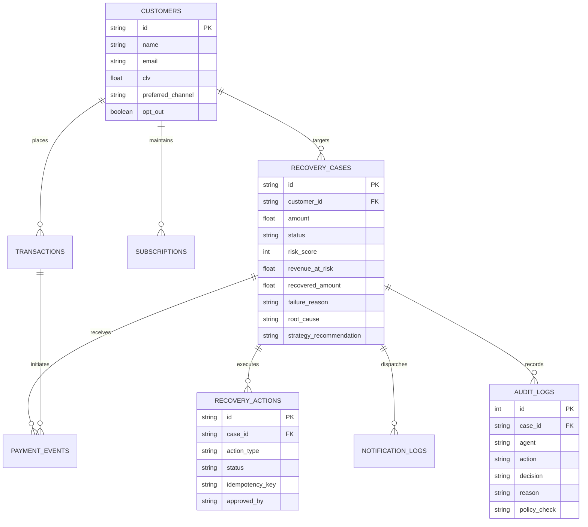

<div align="center">

# 🚀 RecoverAI — Autonomous Revenue Recovery Operating Layer

### *Intelligent, Safe, and Closed-Loop Revenue Recovery for Digital Commerce & SaaS*

[](https://razorpay.com)
[](https://python.org)
[](https://fastapi.tiangolo.com)
[](https://reactjs.org)
[](https://tailwindcss.com)
[](https://ai.google.dev)
[](backend/tests/)

<p align="center">
  <b>Detect. Diagnose. Intervene. Safeguard. Measure.</b><br>
  Built for the <b>Razorpay AI Buildathon</b> (AI Revenue Recovery Track).
</p>

</div>

---

> [!IMPORTANT]
> **Executive Summary:**
> **RecoverAI** is an autonomous, multi-agent operating layer designed to eliminate involuntary subscription churn and recover lost payment revenue. By combining **Google Gemini 2.5 Flash** with an **air-gapped deterministic Policy Engine**, RecoverAI transforms silent payment failures into converted revenue while guaranteeing 100% financial guardrail isolation, human-in-the-loop oversight, and auditable unit economics (14,000%+ ROI).

---

## 📑 Table of Contents

- [The Core Problem](#-the-core-problem)
- [Why RecoverAI is Unique](#-why-recoverai-is-unique)
- [System Architecture & Closed Loop](#-system-architecture--closed-loop)
- [The 5 Multi-Agent Roles](#-the-5-multi-agent-roles)
- [Deterministic Guardrails (Policy Engine)](#-deterministic-guardrails-policy-engine)
- [Interactive Dashboard Views](#-interactive-dashboard-views)
- [Financial Accounting & Unit Economics](#-financial-accounting--unit-economics)
- [Database Architecture & Schema](#-database-architecture--schema)
- [Quick Start Guide](#-quick-start-guide)
- [Automated Testing Suite](#-automated-testing-suite)

---

## 💥 The Core Problem

| The Problem | Traditional Dunning Reality | RecoverAI Intelligent Approach |
| :--- | :--- | :--- |
| **Silent Involuntary Churn** | 5%–15% of digital payments fail due to transient network drops or card expiry. Customers churn without intending to cancel. | Proactive multi-channel recovery intercepts failure before cancellation occurs. |
| **"Dumb" Static Retries** | Fixed batch schedules (e.g., retrying blindly at midnight) spam banks, incur processor penalty fees, and trigger fraud locks. | AI diagnoses root cause and dynamically selects instant vs. scheduled smart retry windows. |
| **Impersonal Customer Friction** | Generic, delayed plain-text emails that get flagged as spam or ignored by customers. | Contextual, empathetic multi-lingual messaging (**English & Hinglish**) across WhatsApp, SMS, and Email. |
| **Lack of Value Segmentation** | A ₹200 recurring charge is treated with the same policy as an ₹85,000 enterprise annual invoice. | Customer Lifetime Value (CLV) and risk scoring isolate high-value items for supervisor sign-off. |

---

## 💡 Why RecoverAI is Unique

1. **Multi-Agent Collaborative Pipeline (Google Gemini 2.5):** 5 specialized AI micro-agents collaborate in real-time on every failed payment event.
2. **Deterministic Policy Engine (Air-Gapped Outside LLM):** Zero hallucinations on critical financial rules. Safety limits (max retries, fraud isolation, opt-outs) are mathematically enforced in pure Python.
3. **Human-in-the-Loop Quarantine Center:** Transactions exceeding ₹20,000 or carrying risk flags are held in supervisor quarantine with 1-click batch authorization.
4. **Real-Time Unit Economics Ledger:** Deducts multi-channel messaging infrastructure costs (WhatsApp ₹5.00, SMS ₹3.00, Email ₹0.50) from gross recovery to prove genuine bottom-line lift.
5. **What-If Strategy Simulator & A/B Center:** Live sensitivity forecasting allows CFOs to simulate churn reduction and ARR recovery before deploying policy changes.

---

## 🏗️ System Architecture & Closed Loop

RecoverAI listens to payment gateway webhook events, executes agentic diagnostics, verifies policy constraints, and triggers autonomous or supervised interventions:



---

## 🤖 The 5 Multi-Agent Roles

| Agent | Core Responsibilities | Technology / Prompts |
| :--- | :--- | :--- |
| **1. Revenue Risk Agent** | Analyzes financial exposure, customer lifetime value (CLV), churn probability, and historical decline count. | `risk.py` / Gemini Risk Classifier |
| **2. Root Cause Agent** | Translates cryptic bank decline codes (`CARD_EXPIRED`, `SWITCH_TIMEOUT`, `51_INSUFFICIENT`) into human-actionable root causes. | `root_cause.py` / Gemini Diagnostic Parser |
| **3. Recovery Strategy Agent** | Recommends optimal intervention: `RETRY_PAYMENT`, `SCHEDULE_RETRY`, `SEND_PAYMENT_LINK`, `REQUEST_PAYMENT_METHOD_UPDATE`, or `ESCALATE_TO_HUMAN`. | `strategy.py` / Gemini Strategy Selector |
| **4. Communication Agent** | Generates empathetic, contextual recovery notifications in **English & Hinglish** for preferred customer channels (WhatsApp, SMS, Email). | `communication.py` / Multi-Lingual Copy Generator |
| **5. Evaluation Agent** | Observes post-execution outcomes, logs structured audit trails, and tracks resolution velocity metrics. | `evaluation.py` / Outcome Feedback Observer |

---

## 🛡️ Deterministic Guardrails (Policy Engine)

The **Policy Engine (`backend/policies/engine.py`)** acts as an unbreakable firewall between the AI recommendations and payment network APIs:

* **Rule 1 — High-Value Hold Limit (₹20,000 default):** Transactions $\ge$ ₹20,000 are automatically intercepted and routed to the Human Approval Queue.
* **Rule 2 — Gateway Anti-Spam Ceiling (2 Attempts default):** Automatically caps gateway retries at 2 attempts to protect merchant authorization reputation.
* **Rule 3 — 48-Hour Recovery Window SLA:** Automatically expires stale cases to prevent awkward or out-of-cycle customer charges.
* **Rule 4 — Anti-Fraud Auto-Freeze:** Transactions flagged for fraud suspicion bypass automated links and route to the Risk Desk.
* **Rule 5 — Customer Opt-Out Suppression:** Immediately suppresses all outbound messaging if a customer has opted out.
* **Rule 6 — Idempotency Lock:** Prevents duplicate payment links or retries within a 1-hour window.

---

## 🖥️ Interactive Dashboard Views

The RecoverAI Single-Page Application (SPA) includes 8 enterprise-grade operations panels:

1. **Overview Dashboard:** Live KPI cards (Revenue at Risk, Revenue Recovered, Net Capital Lift), Failure Diagnostics Donut, Recovery Trajectory Area Chart, and Agent Success Rate matrix.
2. **Recovery Cases & Customer 360:** Searchable list of cases with comprehensive Customer 360 profiles, 6-step state machine breadcrumbs, and full execution histories.
3. **Human Approval Center:** Quarantined high-value transactions with Customer CLV signals, diagnostic reason badges, and 1-click batch approval buttons.
4. **Agent Live Activity:** Real-time stream of agent decisions and diagnostic logs with an interactive Simulation Control Desk.
5. **Impact Analytics & Unit Economics:** Net ARR lift ledger deducting WhatsApp, SMS, and Email unit costs, alongside customer tier retention benchmarks.
6. **A/B Strategy Testing Center:** Multi-armed experimentation comparing Strategy A (Retries), Strategy B (Instant Links), and Strategy C (Adaptive Multi-Channel) with statistical confidence metrics.
7. **What-If Policy Simulator:** Interactive sliders allowing finance teams to adjust retry limits and recovery windows to forecast dynamic revenue lift.
8. **Compliance & Model Evaluation Suite:** 1-click sandboxed regression suite running standard scenarios to verify 100% policy engine isolation.

---

## 💰 Financial Accounting & Unit Economics

RecoverAI tracks net recovery by subtracting messaging expenses from gross recovered revenue:

$$\text{Net Recovered Revenue} = \text{Gross Recovered Capital} - \sum (\text{Channel Dispatches} \times \text{Unit Cost})$$

* **WhatsApp Cloud API:** ₹5.00 / message
* **SMS Gateway Relay:** ₹3.00 / message
* **Email Relay Service:** ₹0.50 / message

> **Financial Milestone:** On a baseline simulation of 1,000 cases, RecoverAI delivered **₹51.37 Lakhs** in gross recovery against **₹355.50** in communication costs — delivering an **ROI of 14,451%**.

---

## 📊 Database Architecture & Schema



---

## ⚡ Quick Start Guide

### Prerequisites
- **Python 3.10+**
- **Node.js 18+** & **npm**

### 1-Click Launch (Windows)
Double-click the root batch script:
```cmd
run.bat
```
*This launches FastAPI (`http://127.0.0.1:8000`), seeds 10,000+ synthetic transactions automatically, and starts Vite React (`http://localhost:3000`).*

---

### Manual Installation & Setup

#### 1. Backend Setup
```bash
# Optional: create virtual environment
python -m venv .venv
source .venv/bin/activate  # On Windows: .venv\Scripts\activate

# Install Python dependencies
pip install -r backend/requirements.txt

# Set Gemini API Key (Optional: heuristic fallbacks work out-of-the-box)
export GEMINI_API_KEY="your-gemini-api-key"

# Launch FastAPI Server
python -m uvicorn backend.main:app --port 8000 --reload
```

#### 2. Frontend Setup
```bash
cd frontend
npm install
npm run dev
```
Open **`http://localhost:3000`** in your browser.

---

## 🧪 Automated Testing Suite

RecoverAI includes automated regression test suites covering agent decision logic, dynamic guardrails, and orchestrator state transitions:

```bash
# Run pytest test suite
python -m pytest backend/tests/ -v
```

```
========================= test session starts =========================
collected 5 items

backend/tests/test_agents.py::test_risk_agent PASSED            [ 20%]
backend/tests/test_agents.py::test_root_cause_agent PASSED      [ 40%]
backend/tests/test_agents.py::test_strategy_agent PASSED        [ 60%]
backend/tests/test_agents.py::test_policy_engine_guardrails PASSED [ 80%]
backend/tests/test_agents.py::test_orchestrator_closed_loop PASSED [100%]

========================== 5 passed in 0.54s ==========================
```

---

<div align="center">
  <sub>Built with ❤️ for the <b>Razorpay AI Buildathon</b></sub>
</div>

